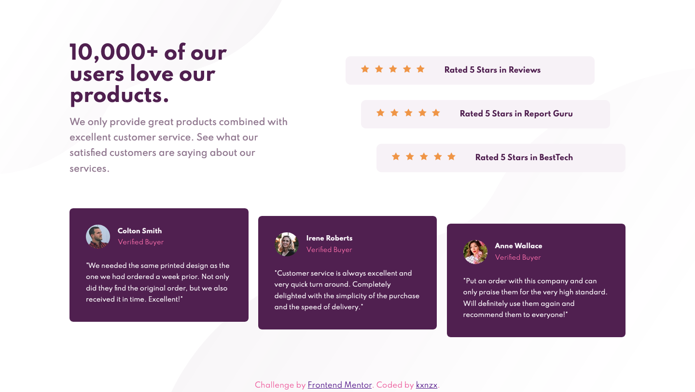

# Frontend Mentor - Social Proof Section Solution

This is a solution to the [Social proof section challenge on Frontend Mentor](https://www.frontendmentor.io/challenges/social-proof-section-6e0qTv_bA). Frontend Mentor challenges help you improve your coding skills by building realistic projects.

## Table of contents

- [Overview](#overview)
  - [The challenge](#the-challenge)
  - [Screenshot](#screenshot)
  - [Links](#links)
- [My process](#my-process)
  - [Built with](#built-with)
  - [What I learned](#what-i-learned)
- [Author](#author)

## Overview

### The challenge

Users should be able to:

- View the optimal layout for the section depending on their device's screen size

### Screenshot



### Links

- Solution URL: [Add solution URL here](https://your-solution-url.com)
- Live Site URL: [Add live site URL here](https://your-live-site-url.com)

## My process

- HTML semantics
- Importing Google Fonts
- Set variables in root
- Reset default settings
- Global Styles (Mobile First)
- Content Styles
- Layout Styles (Mobile First)
- Media Queries (Desktop)

### Built with

- Semantic HTML5 markup
- CSS custom properties
- Flexbox
- CSS Grid
- Mobile-first workflow
- [Google Fonts](https://fonts.google.com/) - Styling Fonts

### What I learned

- This is my first time working with CSS Grid.

- I discovered that HTML Semantics can be in conflict with the desired layout. In this challenge the "main" tag interfered with the required design. I found a way to disable this:

```html
display: contents;
```

```html
The above property and value causes an element's children to appear as if they
were direct children of the element's parent, ignoring the element itself.
```

- I also learned a way to center the container horizontally and vertically on the page:

```css
width: 90%;
position: absolute;
height: 100vh;
top: 50%;
left: 50%;

-webkit-transform: translate(-50%, -50%);
-moz-transform: translate(-50%, -50%);
-o-transform: translate(-50%, -50%);
-ms-transform: translate(-50%, -50%);
transform: translate(-50%, -50%);
```

- The other thing I learned is how to make sure the footer stays down on the bottom of the page (with CSS Grid). First I set a min-heigth value on the body container, because in default the heigth of the body is set to "auto" which means it's only as tall as the content it contains:

```
min-height: 100vh;
```

```
The above property and value means that the body container has to always have at least a minimum heigth of 100% of the available viewport heigth. With this set, no matter how little content is on the page, the body element will always have a height of at least the viewport or browser window.
```

Then I set the value of the row of the footer on auto:

```
grid-template-rows: 1fr 1fr auto;
```

```
"Auto" means that this row will match the height of the footer element and it's content. The other content is set on the "fraction unit". This content get's the available space that is left over inside the parent grid-container. In this case the content will get one fraction/piece of the he available space.
```

## Author

- Frontend Mentor - [@kxnzx](https://www.frontendmentor.io/profile/kxnzx)
